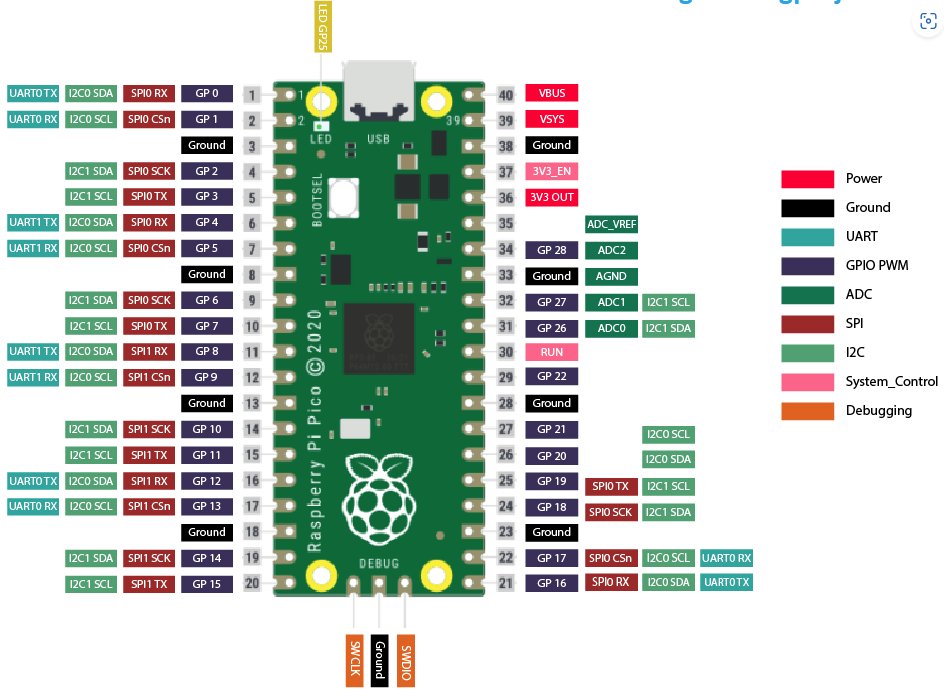
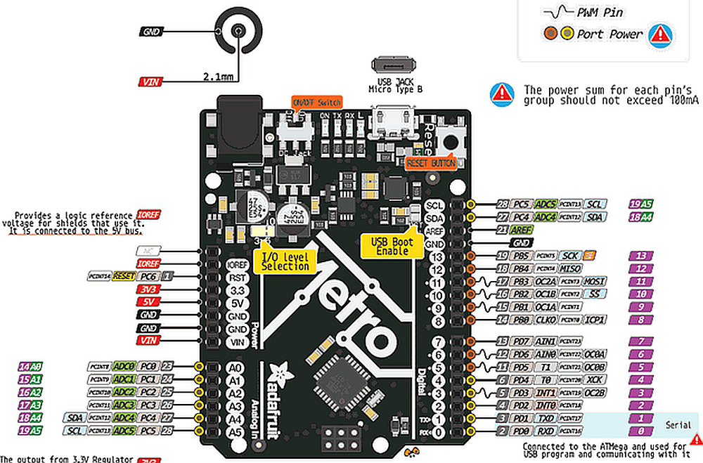

# RPIpico-ESP-Python
Micro Python mit dem  Raspberry Pi Pico/Pico W

|[:skull:ISSUE](https://github.com/frankyhub/RPIpico-Python/issues?q=is%3Aissue)|[:speech_balloon: Forum /Discussion](https://github.com/frankyhub/RPIpico-Python/discussions)|[:grey_question:WiKi](https://github.com/frankyhub/RPIpico-Python/wiki)||
|--|--|--|--|
| | | | |
||<a href="https://github.com/frankyhub/RPIpico-Python/issues">|<a href="https://github.com/frankyhub/RPIpico-Python/discussions">|<a href="https://github.com/frankyhub/RPIpico-Python/releases">|
|| <a href="https://github.com/frankyhub/RPIpico-Python/pulse" alt="Activity">| <a href="https://github.com/frankyhub/RPIpico-Python/graphs/traffic">  |<a href="https://github.com/frankyhub?tab=stars"> |

